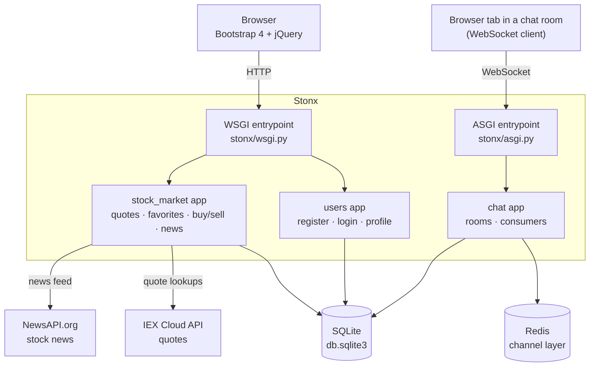
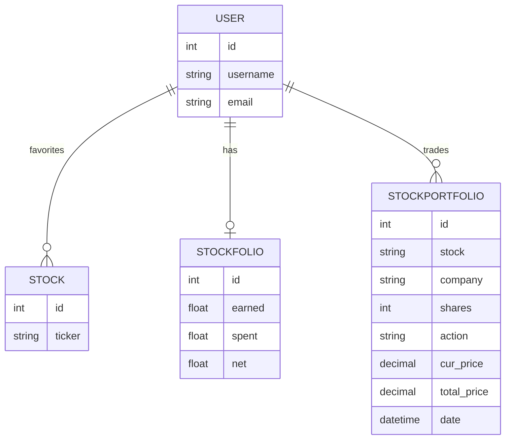
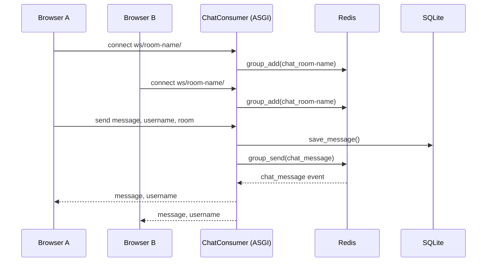

# Stonx

Stonx is a Django web app for practicing stock trading without risking real money. Users look up quotes, keep a watchlist, "buy" and "sell" shares against a simulated portfolio, read market news, and chat with other users in real time.


## Features

- **Quote lookup** — search any ticker from the navbar and get a quote
- **Favorites / watchlist** — save tickers per user and see their current quotes
- **Paper trading** — buy and sell shares against a simulated position; every trade is logged
- **Portfolio tracking** — running total of amount spent, amount earned, and net P&L per user
- **Stock news** — headlines pulled from a news API
- **Real-time chat rooms** — WebSocket chat, one room per URL, backed by Django Channels
- **Accounts** — registration, login/logout, and profile editing on top of Django's built-in auth

## Tech Stack

| Layer | Technology |
|---|---|
| Backend framework | Django 3.2 |
| Real-time / WebSockets | Django Channels 3, Redis (channel layer) |
| Database | SQLite (default dev database) |
| Frontend | Django templates, Bootstrap 4, jQuery, django-crispy-forms |
| External data | IEX Cloud (quotes), NewsAPI.org (news) |
| Auth | Django's built-in `django.contrib.auth` |

## Architecture

### System overview

Stonx is one Django project with three apps behind two entry points: the normal **WSGI** path for HTTP requests, and an **ASGI** path (via Channels) for the WebSocket chat.



- `stock_market` and `users` are plain Django apps served over HTTP/WSGI.
- `chat` is served over WebSocket/ASGI; `ChatConsumer` uses Redis as the Channels layer to fan messages out to everyone in a room.
- All three apps share the same SQLite database.
- `stock_market` is the only app that talks to the outside world — IEX Cloud for quotes, NewsAPI.org for news.

### Data model



- `Stock` is a favorited ticker tied to a user (the watchlist).
- `StockPortfolio` is the trade ledger — one row per buy/sell, with the price and share count at the time of the trade.
- `StockFolio` is a running per-user total (`earned`, `spent`, `net`), updated by `StockPortfolio.buy()` / `.sell()` whenever a trade is saved.
- Chat's `Message` model isn't shown here — it only stores a username as plain text, with no foreign key to `User`.

### Real-time chat flow



- Each browser tab opens a WebSocket to `ws/<room_name>/`.
- `ChatConsumer.connect()` adds the socket to a Redis-backed group named `chat_<room_name>`.
- On an incoming message, the consumer saves it to SQLite, then re-broadcasts it to the whole group, so every connected tab receives it — including the sender's.

## Project Structure

```
Stonx/
├── manage.py
├── requirements.txt      
├── .env.example          
├── stonx/                 # Django project package
│   ├── settings.py
│   ├── urls.py
│   ├── asgi.py            # Channels entrypoint (HTTP + WebSocket)
│   └── wsgi.py
├── stock_market/          # Core trading app
│   ├── models.py           # Stock, StockFolio, StockPortfolio
│   ├── views.py             # quotes, favorites, buy/sell, news
│   ├── forms.py
│   ├── urls.py
│   ├── admin.py
│   ├── templates/
│   └── static/
├── users/                  # Auth & profile app
│   ├── views.py              # register, profile
│   ├── forms.py
│   └── templates/
└── chat/                    # Real-time chat app
    ├── consumers.py          # WebSocket consumer
    ├── routing.py             # WebSocket URL routes
    ├── models.py              # Message
    ├── views.py
    └── templates/
```

## Prerequisites

- Python 3.8–3.10 (Django 3.2's supported range)
- Redis, running locally — only needed for the chat app's channel layer
- Two free API keys: [IEX Cloud](#environment-variables) and [NewsAPI.org](https://newsapi.org)

## Getting Started

### 1. Clone the repo

```bash
git clone https://github.com/sarthak-dv/Stonx.git
cd Stonx
```

### 2. Create a virtual environment

```bash
python -m venv venv
source venv/bin/activate      # Windows: venv\Scripts\activate
```

### 3. Install dependencies

The repo doesn't include a `requirements.txt`. The one alongside this README was reconstructed from the packages actually imported in the code:

```bash
pip install -r requirements.txt
```

### 4. Configure environment variables

Views load `IEX_API_KEY` and `NEWS_API_KEY` through `python-dotenv`, from a `.env` file at the project root (same folder as `manage.py`). Copy the example and fill in your keys:

```bash
cp .env.example .env
```

### 5. Start Redis

The chat app needs Redis reachable at `127.0.0.1:6379`:

```bash
# macOS (Homebrew)
brew install redis && brew services start redis

# Ubuntu/Debian
sudo apt install redis-server && sudo service redis-server start
```

### 6. Apply migrations

```bash
python manage.py migrate
```

### 7. (Optional) create an admin user

```bash
python manage.py createsuperuser
```

### 8. Run the server

```bash
python manage.py runserver
```
